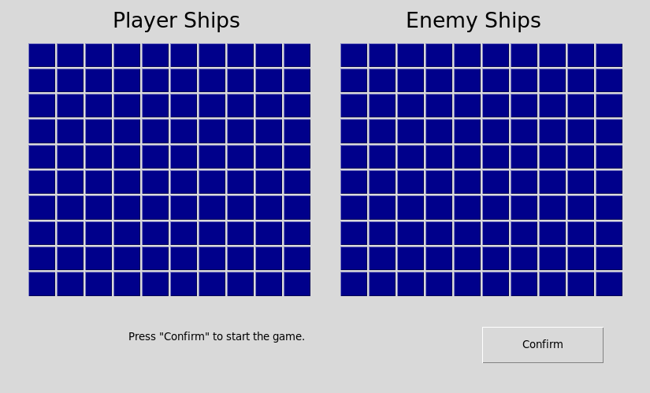

# battleship
Video game based on the Battleship board game

## Running battleship
`python battleship.py`

Note: battleship requires Python 3.

## Playing battleship
To play, follow the onscreen instructions.

The battleship interface consists of two 10 by 10 grids, one representing the player's ships and the other representing the computer's ships. 

## Phases of the game
1. The player places each of their five ships on their board. (The computer does the same behind the scenes.)
2. The player selects an enemy tile to fire upon. They are informed whether or not their attempt was a hit or a miss. 
3. The computer selects a tile of the player to fire upon and the player is informed whether or not the attempt was succesful.
4. Once the player or the computer has hit each ship tile of their opponent, the game is over.
